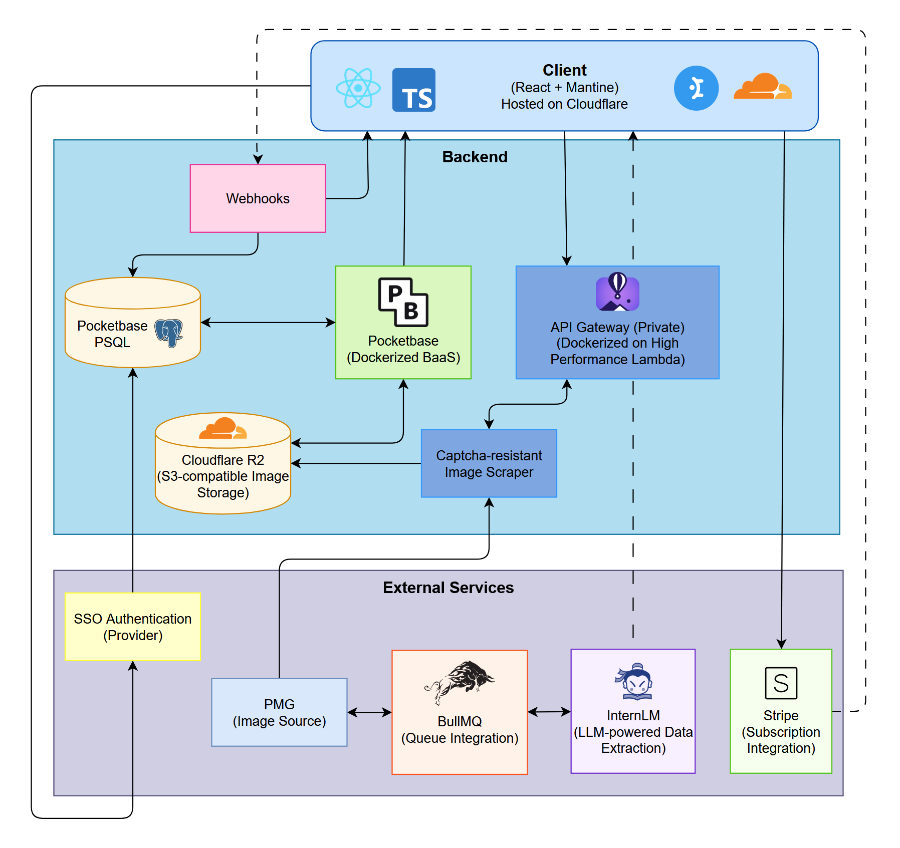

# NumisGallery.com

NumisGallery is a modern web application for collectors to manage, organize, and showcase their **banknote collections**. Built with a full-stack architecture, it supports user authentication, AI-powered scraping and data extraction from PMG (Paper Money Guaranty) images, and a responsive frontend.

  
## Features

- **PMG Integration**: Enter certification number and grade to fetch high-res obverse/reverse images via an external scraping API.
- **AI Data Extraction**: Automatically extracts key details from images using advanced vision models (InternVL):
  - Pick #, face value, currency, year of issue
  - Authority, serial number, grade/EPQ status, watermark
  - Country, note type (US/World), city/bank
- **Smart Form**: Optionally auto-populates extracted data; supports manual edits for purchase price, date, visibility, and featured status.
- **Database Storage**: Saves banknotes to PocketBase within user-specific collections.

- **Authentication**: Secure signup/login with PocketBase (email + username/password) or SSO.
- **Personal Dashboard**: View "Your Banknotes" with advanced sortingand filtering.
- **Dark/Light/Auto Theme**: User-customizable via settings.

- **Gallery View**: Display personal collection with images and metadata.
- **Subscriptions**: Framework for premium features.

## 🚀 Quick Start

1. `npm install` (root) + `cd frontend && npm install`
2. Start services: `npm run dev` (PocketBase + Hermes + Frontend)
3. Visit `http://localhost:5173` (Vite dev server)
4. Signup and add a banknote (e.g., PMG cert `1991248-001`, grade `66`).

## 🔗 External Dependencies

**Hermes** (private repo): scraping proxy
**Public Repo**: https://github.com/willbonney/numisgallery.com  
**License**: Unlicensed
